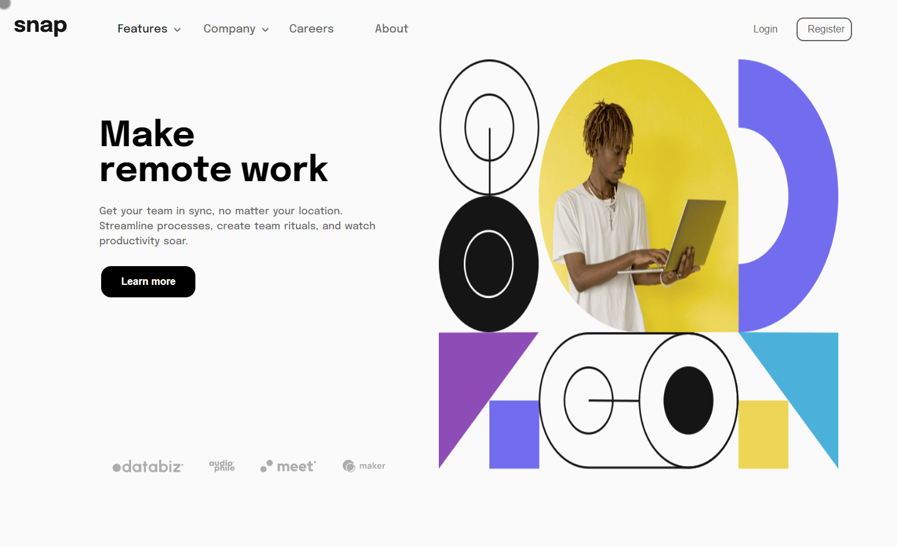

# Frontend Mentor - Intro section with dropdown navigation

## Welcome! 👋

Thanks for checking out this front-end coding challenge.

[Frontend Mentor](https://www.frontendmentor.io) challenges help you improve your coding skills by building realistic projects.

**To do this challenge, you need a basic understanding of HTML, CSS and JavaScript.**

## The challenge

Your challenge is to build out this intro section with dropdown navigation and get it looking as close to the design as possible.

You can use any tools you like to help you complete the challenge. So if you've got something you'd like to practice, feel free to give it a go.

Your users should be able to:

- View the relevant dropdown menus on desktop and mobile when interacting with the navigation links
- View the optimal layout for the content depending on their device's screen size
- See hover states for all interactive elements on the page

### Screenshot

### Links

- Source Code URL: [Source Github](https://github.com/lenez12/blogr-landing-page-main.git)
- Live Site URL: [Demo Live](https://lenez-blogr.netlify.app/)

## My process

### Built with

- Semantic HTML5 markup
- CSS custom properties
- Flexbox
- CSS Grid
- JQuery
- JQuery Masking Input
- vanilla js

### What I learned

what I learned in making this challenge is:

1. layouting using grid css and flex
2. create dropdown menu on hover
3. create accordion menu with javascript
4. responsive layout mobile [375] and desktop [1440]
5. dimensions of element is affect againt of the wrapper

### Continued development

1. In the future I will make a good css class naming name
2. add animation and transition when hover and activate
3. using react to create this layout.

### Useful resources

- [Centering CSS GRID](https://stackoverflow.com/questions/45536537/centering-in-css-grid)
- [Reset CSS](https://piccalil.li/blog/a-modern-css-reset/)
- [Event in DOM](https://developer.mozilla.org/en-US/docs/Web/API/HTMLElement/change_event)
- [Fix Z-index](https://www.freecodecamp.org/news/4-reasons-your-z-index-isnt-working-and-how-to-fix-it-coder-coder-6bc05f103e6c/)
- [Translate](https://developer.mozilla.org/en-US/docs/Web/CSS/transform-function/translate)
- [background position](https://css-tricks.com/almanac/properties/b/background-position/)
- [Event]()
- [Event]()

## Author

- Frontend Mentor - [@Lenez](https://www.frontendmentor.io/profile/lenez12)
- Twitter - [@prak_tech](https://www.twitter.com/prak_tech)

